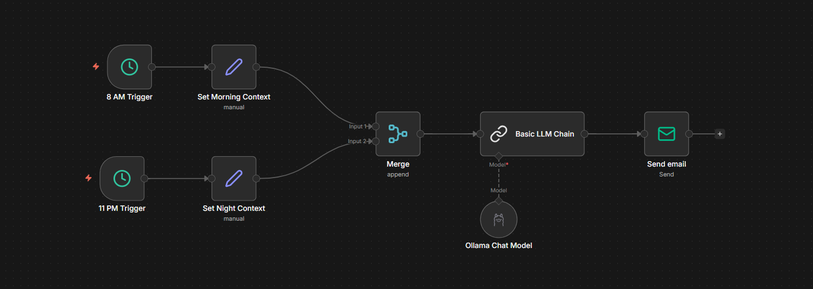

# 💌 The Romantic AI Agent: "Love on Autopilot"
### A Self-Hosted, Zero-Cost Daily Greeting Bot using n8n + Ollama


> **"Never forget to say 'Good Morning' or 'Good Night' again."**

---

## 📖 The Story
We've all been there: You want to send a sweet text to your partner every morning, but sometimes life gets in the way. You wake up late, rush to work, and forget.

**This project solves that.** It is a "Set-and-Forget" AI Agent that:
1.  **Wakes up** twice a day (Morning & Night).
2.  **Thinks** of a unique, creative message using a local AI brain (Llama 3.2).
3.  **Emails** it to your partner with a personal, romantic touch.

**The best part?** It runs entirely on your own computer, keeps your data private, and costs **₹0.00 INR**.

**Total Cost:** ₹0.00 INR (Free) **Privacy:** 100% Local (Self-Hosted)

---

## 🏗️ The Architecture
Instead of building two separate bots, this workflow uses a smart **"Y-Shape" Logic**. It converges different timelines into a single "Brain," ensuring efficient operation.



**The Logic Flow:**
1.  **Dual Triggers ⏰:** The workflow listens for **8:00 AM** and **11:00 PM**.
2.  **Context Setting 🧠:** It labels the event (e.g., "Morning" vs. "Night") and sets a specific Subject Line.
3.  **The Merge 🔀:** The critical step where both timelines unite into one flow.
4.  **The Brain 🦙:** Your local **Ollama** instance generates the text.
5.  **The Delivery 📨:** Gmail SMTP sends the final message with a clean signature.

---

## 🛠️ Prerequisites
*Before you fly, check your gear.*

1.  **n8n (Self-Hosted):** You need n8n running locally (Docker or npm). [Installation Guide](https://docs.n8n.io/hosting/)
2.  **Ollama & Llama 3.2:**
    * Download [Ollama](https://ollama.com/).
    * Run `ollama run llama3.2` in your terminal to pull the model.
3.  **Gmail App Password (Vital!):**
    * You cannot use your normal login password.
    * Go to **Google Account** → **Security** → **2-Step Verification** → **App Passwords**.
    * Generate a new password named "n8n" and copy the 16-character code. You will need this later.
      
---

## 🚀 Step-by-Step Implementation Guide

### Phase 1: The Schedule (Triggers)
We need punctuality.
* **Node 1:** `Schedule Trigger` set to **8:00 AM**.
* **Node 2:** `Schedule Trigger` set to **11:00 PM** (23:00).

### Phase 2: The Context (Variables)
The AI is smart, but it needs context. We use **Edit Fields** nodes to inject data.
* **Morning Path:** Set `time_of_day` to "Morning" and `subject_line` to "Good morning, sunshine ☀️".
* **Night Path:** Set `time_of_day` to "Night" and `subject_line` to "Sweet dreams 🌙".

### Phase 3: The Merge (The Secret Sauce) 🔀
*This is the step most people miss.* We must combine the two paths so we don't have to duplicate our AI logic.
* **Node:** Add a **Merge** node.
* **Connection:** Connect both "Set Context" nodes to the Merge node inputs.
* **Mode:** Select **"Append"**. This acts as a traffic controller, letting whichever trigger fired pass through to the Brain.

### Phase 4: The Brain (Ollama) 🧠
Now, we instruct the AI.
* **Node:** `Basic LLM Chain` connected to `Ollama Chat Model`.
* **The "Anti-Robot" Prompt:**
    > *"You are a loving partner. Write a short text for {{ $json.time_of_day }}. Do NOT use clichés. Do NOT use poetic words like 'celestial' or 'tapestry'. Keep it casual and human. Output ONLY the message body."*
* **Temperature:** Set to **0.9**. This forces the AI to be "Creative" so it never sends the same message twice.

### Phase 5: The Delivery (Email) 📨
* **Node:** `Send Email` (SMTP).
* **Settings:**
    * **Host:** `smtp.gmail.com`
    * **User:** Your Gmail address.
    * **Password:** The 16-character App Password.
    * **Port:** `587`
    * **SSL/TLS:** **OFF** (Important!).
* **The Signature Trick:** In the body text, use:
    ```
    {{ $json.text }}

    Love, Your Name
    ```
    *(Hit Enter twice to ensure the signature sits on its own line!)*

---

## ⚠️ "Gotchas" & Troubleshooting
*I broke it so you don't have to. Here is how to fix common errors.*

### 🚫 Issue 1: The "Sent automatically with n8n" Footer
By default, n8n adds branding to your emails. Nothing kills romance like a "Sent by a Bot" footer.
* **The Fix:** In the Email Node, scroll to **Options** → **Add Option** → **Append n8n Attribution** → Toggle it to **FALSE** (Grey).

### 🌐 Issue 2: "Connection Refused" (Docker Users)
If n8n cannot see Ollama, it's a networking issue.
* **The Fix:** Do not use `localhost`. Use `http://host.docker.internal:11434` as your Base URL.

### 🤖 Issue 3: The AI sounds too poetic
If the AI starts talking about "whispers of the soul," it's hallucinating poetry.
* **The Fix:** Strict prompting. Explicitly forbid words like "tapestry," "soul," and "celestial" in your prompt instructions.

---

## 🌟 How to Run This (Production)
1.  **Import:** Download the `.json` file from this repo and import it into n8n.
2.  **Configure:** Update the SMTP credentials with your own Gmail App Password.
3.  **Activate:** Click the **Publish** button in the top right corner (this effectively "activates" the workflow).
4.  **Relax:** Close the tab. As long as your computer is on, your agent is working.

---
### 👨‍💻 Credits
Built with ❤️ by **Atanu Kumar Bagh**.
